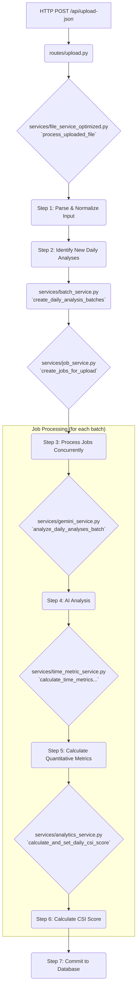
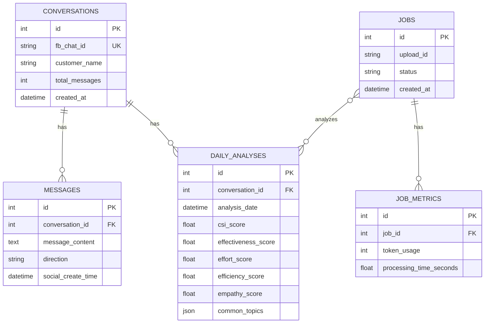

# PowerPulse Application Lifeline

**Version:** 1.0
**Author:** Gemini
**Last Updated:** 2025-08-29

## 1. High-Level Data Flow

This document provides a deep, technical dive into the entire data processing pipeline of the PowerPulse application, from the moment a file is uploaded to the final database commit.

---

## 2. Step-by-Step Breakdown

### Step 1: File Ingestion and Parsing

1.  **Route (`routes/upload.py`):** An HTTP POST request hits the `/api/upload-json` endpoint.
2.  **Background Task:** The route immediately returns an `upload_id` and schedules the `process_uploaded_file` function from `services/file_service_optimized.py` to run as a background task.
3.  **Format Sniffing:** Inside `process_uploaded_file`, the `_parse_and_normalize_input` function reads the raw file content. It intelligently detects the JSON structure (e.g., a raw array, a pre-grouped dictionary, or the single-key object from a database export) and transforms it into a standardized Python dictionary where keys are `chat_id`s and values are lists of message objects.

### Step 2: New Analysis Identification & Batching

1.  **Isolate Daily Work:** The file service iterates through the normalized data and creates a dictionary of all possible `(chat_id, date)` pairs.
2.  **Database Check:** It then performs a single, efficient database query to fetch all `(conversation.fb_chat_id, daily_analysis.analysis_date)` pairs that already exist in the database.
3.  **Filtering:** By comparing the two sets, the service creates a final list of `DailyAnalysis` objects that are confirmed to be new and require processing.
4.  **Object Creation:** The service creates `Conversation`, `Message`, and `DailyAnalysis` SQLAlchemy objects in memory for the new data.
5.  **Batching (`services/batch_service.py`):** The list of new `DailyAnalysis` objects is passed to the `create_daily_analysis_batches` function. This function groups analyses into batches that do not exceed a `MAX_TOKENS_PER_BATCH` limit, ensuring all days for a single conversation stay in the same batch.

### Step 3: Job Creation and Concurrent Processing

1.  **Job Creation (`services/job_service.py`):** For each batch of `DailyAnalysis` objects, a `Job` record is created in the database with a `pending` status.
2.  **Task Scheduling:** The `process_uploaded_file` function creates an `asyncio` task for each `job.id`. A global `asyncio.Semaphore` (with its limit set by `AI_CONCURRENCY` in `config.py`) ensures that only a safe number of these jobs run at the same time.
3.  **Delay:** A configurable delay (`BATCH_PROCESSING_DELAY_SECONDS`) is awaited between the scheduling of each task to further manage rate limits.

### Step 4: AI Analysis (Inside a Job)

1.  **Data Fetching:** Each running job fetches its batch of `DailyAnalysis` objects, including the full message text for each day.
2.  **Prompt Creation (`services/gemini_service.py`):** The `_create_daily_analysis_batch_prompt` function constructs a single, large prompt containing the message data for all analyses in the batch.
3.  **API Call:** The `_call_gemini_with_retry` function sends the prompt to the Google Gemini API. It includes logic for exponential backoff and retries upon failure.
4.  **Response Parsing:** The `_parse_daily_analysis_batch_response` function robustly parses the JSON response from the AI, handling potential formatting errors.

### Step 5 & 6: Metric Calculation & CSI Aggregation

1.  **Time Metrics (`services/time_metric_service.py`):** For each successfully analyzed item from the AI, the `job_service` calls `calculate_time_metrics_for_daily_analysis` to accurately calculate `first_response_time`, `avg_response_time`, and `total_handling_time` from the message timestamps.
2.  **CSI Calculation (`services/analytics_service.py`):** The `job_service` then calls `calculate_and_set_daily_csi_score`. This function takes the AI-generated qualitative metrics and the script-calculated quantitative metrics and computes the four pillar scores (Effectiveness, Effort, Efficiency, Empathy), and finally, the overall weighted CSI score.

### Step 7: Database Persistence

1.  **Update Records:** The `job_service` updates the `DailyAnalysis` records in the database with all the newly calculated metrics and scores.
2.  **Final Commit:** The job marks itself as `completed` or `failed` and commits the changes to the database, concluding its lifecycle.

---

## 3. Database Schema (ERD)

This diagram illustrates the relationships between the core tables in the `powerpulse.db` database.

