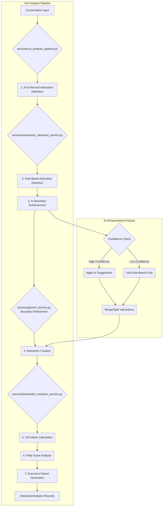
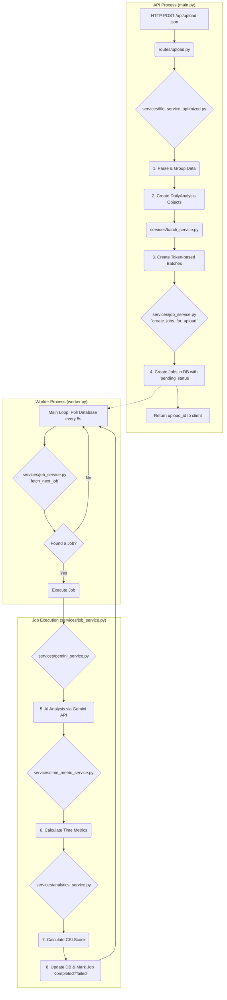
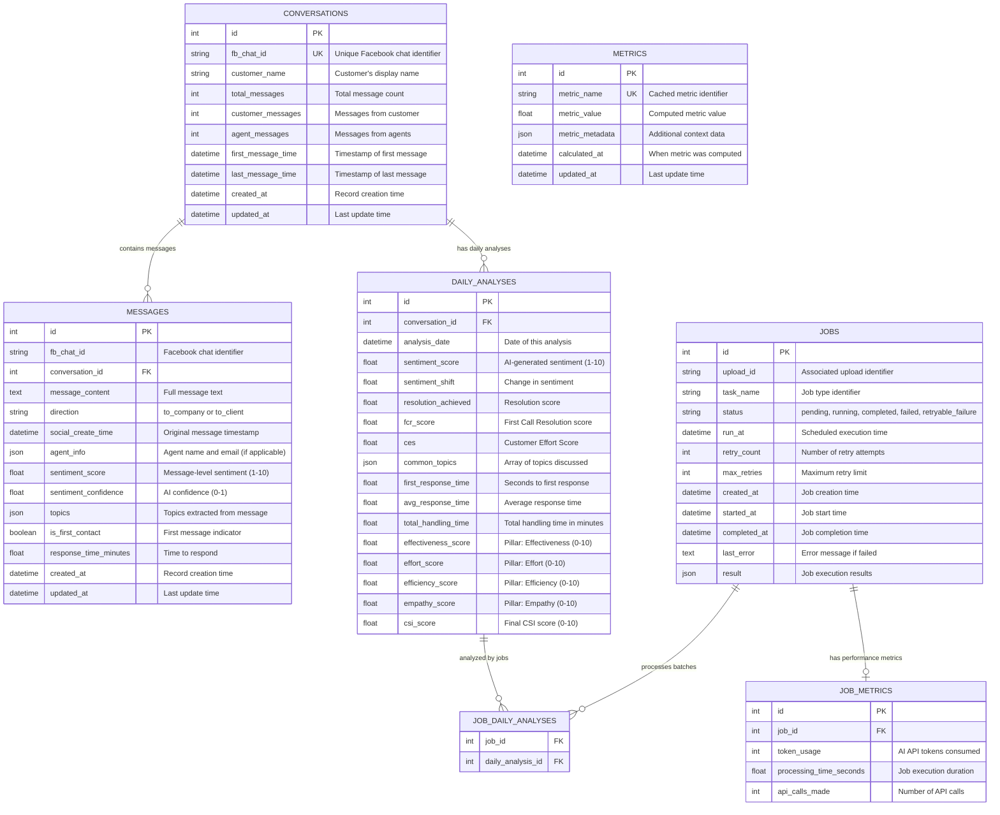

# PowerPulse Application Lifeline

**Version:** 3.0  
**Author:** Gemini  
**Last Updated:** 2025-09-17

## 1. High-Level Data Flow

This document provides a comprehensive technical overview of the PowerPulse application's dual processing pipelines: the legacy Daily Analysis pipeline and the new AI-Enhanced Interaction Detection and Analytics pipeline.

## 1.1 AI-Enhanced Interaction Analysis Pipeline (New)

## 1.2 Legacy Daily Analysis Pipeline (Maintained)

---

## 2. Service Architecture

### 2.1 AI-Enhanced Services (New Pipeline)

1. **CSIAnalysisPipeline** (`services/csi_analysis_pipeline.py`)
   - Orchestrates end-to-end interaction analysis
   - Manages batch processing and health monitoring
   - Generates comprehensive executive reports

2. **InteractionDetectionService** (`services/interaction_detection_service.py`)
   - Hybrid approach: Rule-based + AI enhancement
   - Detects customer service interaction boundaries
   - Achieves 88.5% high-confidence interactions with 7.7% AI usage

3. **InteractionAnalyticsService** (`services/interaction_analytics_service.py`)
   - Comprehensive CSI scoring across 4 pillars
   - Pattern analysis and trend detection
   - Executive reporting and insights generation

4. **Enhanced GeminiService** (`services/gemini_service.py`)
   - AI boundary enhancement for interaction detection
   - CSI assessment and scoring
   - JSON response parsing and validation

### 2.2 Legacy Services (Daily Analysis Pipeline)

1. **FileService** (`services/file_service_optimized.py`)
   - Handles JSON parsing and data extraction
   - Groups messages by day and chat for daily analysis

2. **BatchService** (`services/batch_service.py`)
   - Creates token-aware batches for Gemini API
   - Optimizes API usage and cost

3. **JobService** (`services/job_service.py`)
   - Manages job queue and execution
   - Handles worker process coordination

4. **AnalyticsService** (`services/analytics_service.py`)
   - Calculates CSI metrics and scores for daily analysis
   - Generates performance insights

5. **TimeMetricService** (`services/time_metric_service.py`)
   - Calculates response times and efficiency metrics

---

## 3. Step-by-Step Breakdown

### 3.1 AI-Enhanced Interaction Analysis (New)

1. **Pipeline Initialization:** CSIAnalysisPipeline processes conversation data through hybrid AI enhancement
2. **Interaction Detection:** Rule-based boundaries are enhanced using Gemini AI for optimal accuracy
3. **Analytics Processing:** Comprehensive CSI scoring across 4 pillars with pattern analysis
4. **Executive Reporting:** Automated generation of insights and recommendations

### 3.2 Legacy Daily Analysis Process

#### Step 1: File Ingestion and Parsing

1. **Route (`routes/upload.py`):** An HTTP POST request hits the `/api/upload-json` endpoint.
2. **Synchronous Processing:** The route directly calls `file_service_optimized.optimized_file_service.process_grouped_chats_json()` synchronously and returns an `upload_id` immediately after job creation (not background task execution).
3. **Format Sniffing:** The `_parse_and_normalize_input` function reads the raw file content. It intelligently detects the JSON structure (e.g., a raw array, a pre-grouped dictionary, or the single-key object from a database export) and transforms it into a standardized Python dictionary where keys are `chat_id`s and values are lists of message objects.

#### Step 2: New Analysis Identification & Batching

1. **Isolate Daily Work:** The file service iterates through the normalized data and creates a dictionary of all possible `(chat_id, date)` pairs.
2. **Database Check:** It then performs a single, efficient database query to fetch all `(conversation.fb_chat_id, daily_analysis.analysis_date)` pairs that already exist in the database.
3. **Filtering:** By comparing the two sets, the service creates a final list of `DailyAnalysis` objects that are confirmed to be new and require processing.
4. **Object Creation:** The service creates `Conversation`, `Message`, and `DailyAnalysis` SQLAlchemy objects in memory for the new data.
5. **Batching (`services/batch_service.py`):** The list of new `DailyAnalysis` objects is passed to the `create_daily_analysis_batches` function. This function groups analyses into batches that do not exceed a `MAX_TOKENS_PER_BATCH` limit, ensuring all days for a single conversation stay in the same batch.

#### Step 3: Job Creation and Worker Processing

1. **Job Creation (`services/job_service.py`):** For each batch of `DailyAnalysis` objects, a `Job` record is created in the database with a `pending` status.
2. **Worker Process (`worker.py`):** A separate worker process continuously polls the database every 5 seconds using `job_service.fetch_next_job()` to find pending jobs.
3. **Sequential Execution:** When a job is found, the worker executes it via `job_service.execute_job()` in a new database session, then continues polling for the next job.

#### Step 4: AI Analysis (Inside a Job)

1. **Data Fetching:** Each running job fetches its batch of `DailyAnalysis` objects, including the full message text for each day.
2. **Prompt Creation (`services/gemini_service.py`):** The `_create_daily_analysis_batch_prompt` function constructs a single, large prompt containing the message data for all analyses in the batch.
3. **API Call:** The `_call_gemini_with_retry` function sends the prompt to the Google Gemini API. It includes logic for exponential backoff and retries upon failure.
4. **Response Parsing:** The gemini service robustly parses the JSON response from the AI, handling potential formatting errors and extracting metrics for each daily analysis.

#### Step 5 & 6: Metric Calculation & CSI Aggregation

1. **Time Metrics (`services/time_metric_service.py`):** For each successfully analyzed item from the AI, the `job_service` calls `calculate_time_metrics_for_daily_analysis` to accurately calculate `first_response_time`, `avg_response_time`, and `total_handling_time` from the message timestamps.
2. **CSI Calculation (`services/analytics_service.py`):** The `job_service` then calls `calculate_and_set_daily_csi_score`. This function takes the AI-generated qualitative metrics and the script-calculated quantitative metrics and computes the four pillar scores (Effectiveness, Effort, Efficiency, Empathy), and finally, the overall weighted CSI score.

#### Step 7: Database Persistence

1. **Update Records:** The `job_service` updates the `DailyAnalysis` records in the database with all the newly calculated metrics and scores.
2. **Final Commit:** The job marks itself as `completed` or `failed` and commits the changes to the database, concluding its lifecycle.
3. **Worker Continuation:** The worker process returns to polling for the next pending job, maintaining continuous processing until all jobs are complete.

---

---

## 4. Database Schema (ERD)

This diagram illustrates the relationships between the core tables in the `powerpulse.db` database.

