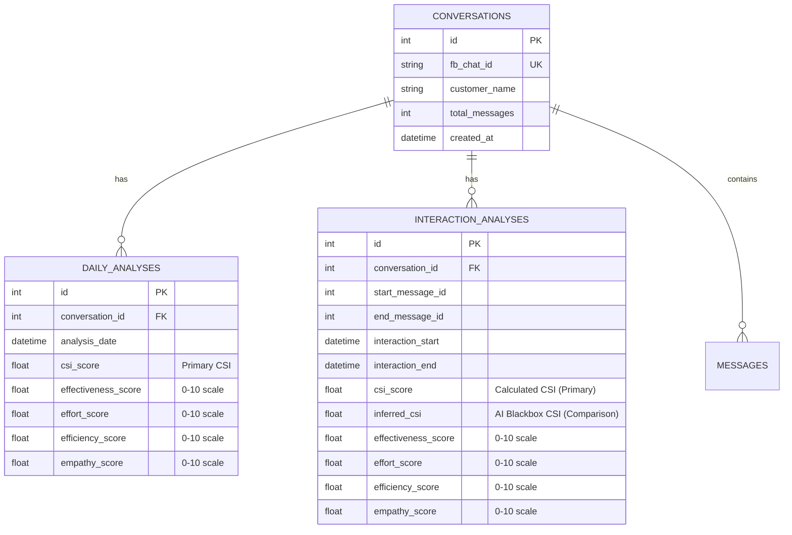

# Models.py Knowledge Base

## Database Schema Analysis

### Core Architecture Overview

The data model implements a **dual analysis system**:
1. **Legacy**: Daily-based analysis (`DailyAnalysis` table)  
2. **New**: Interaction-based analysis (`InteractionAnalysis` table)

### Table Relationships



## Critical Schema Issues Identified

### 1. **CSI Calculation Hierarchy** ✅ **CORRECTLY DESIGNED**

**InteractionAnalysis Model (Lines 150-160):**
```python
# --- Final CSI Score for the Interaction ---
csi_score = Column(Float, nullable=True, index=True) # 0-10 scale (calculated from four-pillars)
inferred_csi = Column(Float, nullable=True)          # 0-10 scale (AI blackbox inference)
```

**Analysis:**
- ✅ `csi_score` = **Primary calculated CSI** (from micro-metrics → pillars → weighted)
- ✅ `inferred_csi` = **Secondary AI blackbox** (for comparison)
- ✅ **This is the CORRECT architecture** per original requirements

### 2. **Micro-Metrics Foundation** ✅ **PROPERLY STRUCTURED**

**Both DailyAnalysis and InteractionAnalysis have identical micro-metrics:**
```python
# --- Micro-Metrics (from AI or calculated) ---
sentiment_score = Column(Float, nullable=True)        # 0-10 scale
sentiment_shift = Column(Float, nullable=True)        # -5 to +5
resolution_achieved = Column(Float, nullable=True)    # 0-10 scale
fcr_score = Column(Float, nullable=True)             # 0-10 scale
ces = Column(Float, nullable=True)                   # 1-7 scale (Customer Effort Score)
first_response_time = Column(Float, nullable=True)   # seconds
avg_response_time = Column(Float, nullable=True)     # seconds
total_handling_time = Column(Float, nullable=True)   # minutes

# --- Pillar Scores (Calculated from Micro-metrics) ---
effectiveness_score = Column(Float, nullable=True)   # 0-10 scale
effort_score = Column(Float, nullable=True)         # 0-10 scale
efficiency_score = Column(Float, nullable=True)     # 0-10 scale
empathy_score = Column(Float, nullable=True)        # 0-10 scale
```

**Analysis:**
- ✅ **Micro-metrics** provide the foundation
- ✅ **Pillar scores** calculated from micro-metrics  
- ✅ **CSI score** calculated from pillar scores with weights
- ✅ **Architecture follows original four-pillars design**

### 3. **Interaction Detection Metadata** ✅ **WELL DESIGNED**

**InteractionAnalysis includes sophisticated boundary detection:**
```python
# Message Range
start_message_id = Column(Integer, nullable=False)   # First message in interaction
end_message_id = Column(Integer, nullable=False)     # Last message in interaction

# Interaction Boundaries  
interaction_start = Column(DateTime, nullable=False)  # First message timestamp
interaction_end = Column(DateTime, nullable=False)    # Last message timestamp
interaction_type = Column(String, nullable=True)     # "outage", "billing", "inquiry"
interaction_complexity = Column(String, nullable=True) # "simple", "moderate", "complex"

# Detection Metadata
boundary_method = Column(String, nullable=False)     # "time_gap", "resolution_keywords", "ai_detected"
boundary_confidence = Column(Float, nullable=True)   # 0.0-1.0 confidence score
```

**Analysis:**
- ✅ **Proper interaction boundaries** with message ID range
- ✅ **Detection methodology tracking** for audit purposes
- ✅ **Confidence scoring** for AI-enhanced boundaries
- ✅ **Interaction classification** (type, complexity)

### 4. **Job Processing Architecture** ✅ **ROBUST DESIGN**

**Many-to-many relationships through association tables:**
```python
job_daily_analyses = Table('job_daily_analyses', Base.metadata,
    Column('job_id', Integer, ForeignKey('jobs.id'), primary_key=True),
    Column('daily_analysis_id', Integer, ForeignKey('daily_analyses.id'), primary_key=True)
)

job_interaction_analyses = Table('job_interaction_analyses', Base.metadata,  
    Column('job_id', Integer, ForeignKey('jobs.id'), primary_key=True),
    Column('interaction_analysis_id', Integer, ForeignKey('interaction_analyses.id'), primary_key=True)
)
```

**Analysis:**
- ✅ **Batch processing support** for both daily and interaction analyses
- ✅ **Job tracking** with retry logic and performance metrics
- ✅ **Flexible association** allows same job to process multiple analysis types

## Schema Strengths

1. **✅ Dual Analysis Support**: Maintains legacy daily analysis while adding interaction-based
2. **✅ Proper CSI Hierarchy**: `csi_score` (calculated) primary, `inferred_csi` (AI) secondary  
3. **✅ Comprehensive Micro-metrics**: 8+ metrics feeding into 4 pillars feeding into CSI
4. **✅ Interaction Boundary Tracking**: Sophisticated detection with confidence scoring
5. **✅ Job Processing**: Robust background processing with retry and metrics

## Potential Issues

1. **⚠️ Scale Consistency**: Some metrics use 0-10 scale, others use 1-7 (CES) - needs normalization
2. **⚠️ Nullable Fields**: Most analysis fields are nullable - could lead to incomplete data
3. **⚠️ Index Strategy**: Only `csi_score` is indexed - might need more for performance

## Developer Confusion Points

**The developer's confusion about "calculated CSI comes out of nowhere" is INCORRECT.**

**The schema clearly shows:**
- Micro-metrics → Pillar scores → CSI score (calculated)
- This is the PRIMARY CSI (`csi_score` field)
- AI blackbox is SECONDARY (`inferred_csi` field)

**The database schema is CORRECTLY designed per original requirements.**

---

**Status**: Schema analysis complete - **SCHEMA IS CORRECT**  
**Issue**: Developer misunderstood the calculation hierarchy in service layer